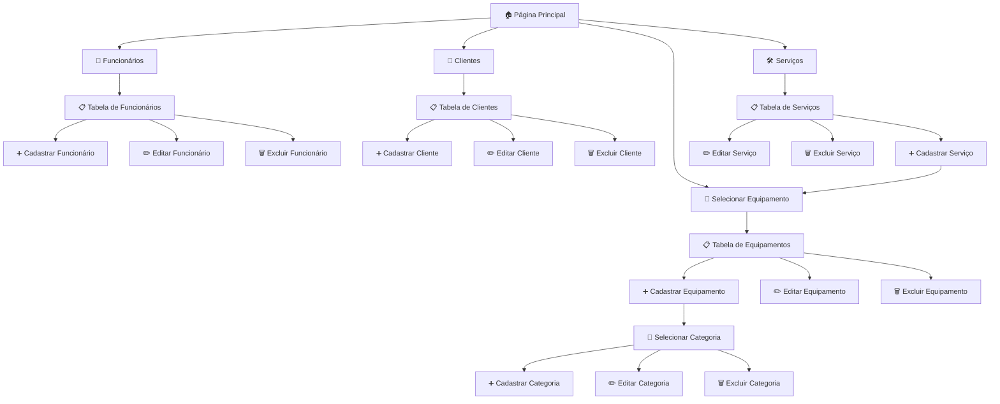

# 🖥️ Sistema de Gerenciamento de Manutenção de Computadores

  
  
  
  
  
  
  

Este projeto foi desenvolvido em **2024** no curso de **Desenvolvimento de Sistemas (SENAC Quixadá)**.  
O objetivo é criar um sistema **simples, mas completo**, para gerenciar uma loja de manutenção de computadores.

---

## 📑 Tópicos
- [🚀 Tecnologias Utilizadas](#-tecnologias-utilizadas)  
- [📋 Funcionalidades](#-funcionalidades)  
- [📑 Estrutura de Páginas](#-estrutura-de-páginas)  
- [🗂️ Fluxo de Navegação do Sistema](#️-fluxo-de-navegação-do-sistema)  
- [🎯 Objetivo](#-objetivo)  

---

## 🚀 Tecnologias Utilizadas
- **Java** (com Maven)  
- **Hibernate** (ORM para persistência de dados)  
- **JavaFX** (interface gráfica)  
- **PostgreSQL** (banco de dados principal)  
- **SQLite** (adaptação posterior para ambiente alternativo)

---

## 📋 Funcionalidades
O sistema oferece um gerenciamento completo de:  
- Funcionários  
- Clientes  
- Serviços  
- Equipamentos  

### 🔧 O que é possível fazer:
- **Cadastrar, editar e excluir serviços** vinculados a clientes e seus respectivos equipamentos.  
- Associar os **funcionários responsáveis** por cada manutenção.  
- Inserir **mais de um equipamento** por serviço.  
- Gerar **orçamentos estimados** pelos funcionários.  
- Registrar uma **descrição detalhada** do caso.  
- Acompanhar a **data de abertura** e a **data de fechamento** do serviço.  

---

## 📑 Estrutura de Páginas
Cada entidade do sistema (**Funcionários, Clientes, Serviços e Equipamentos**) possui uma **página dedicada**.  
Nessas páginas, há uma **tabela geral** para visualização e gerenciamento dos dados, permitindo:  
- Listar todos os registros cadastrados.  
- Adicionar novos registros.  
- Editar registros existentes.  
- Excluir registros.  

Essa estrutura garante uma navegação simples e intuitiva, centralizando o controle de cada módulo do sistema.

---

## 🗂️ Fluxo de Navegação do Sistema

---

## 🎯 Objetivo
Este projeto visa oferecer uma solução prática e educativa para consolidar os conhecimentos em **desenvolvimento de sistemas desktop**, utilizando boas práticas de programação e banco de dados.
